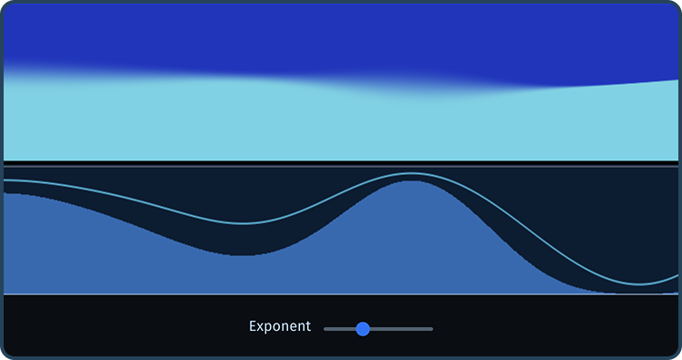
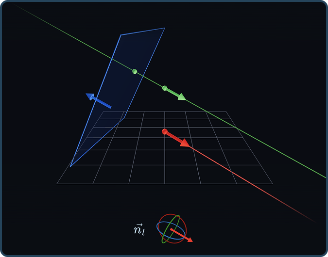
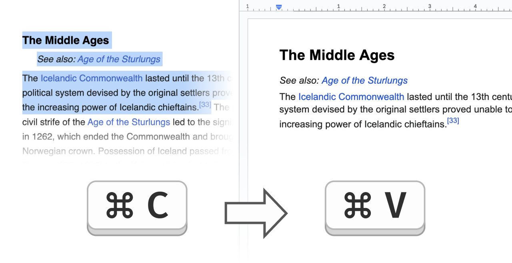
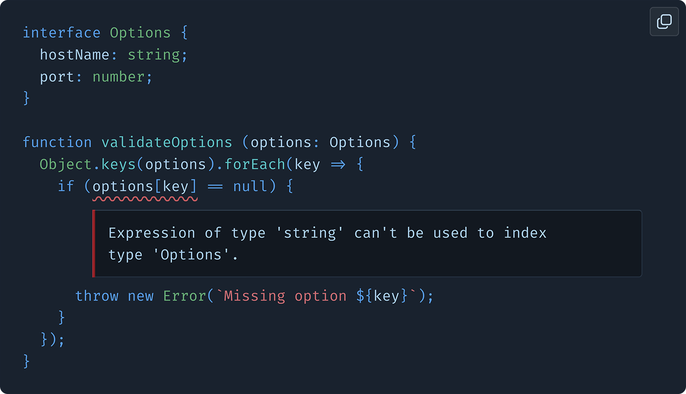

<h1 align="center">
  alexharri.com
</h1>

  <a href="https://alexharri.com" target="_blank">Home</a> · <a href="https://alexharri.com/blog" target="_blank">Blog</a> · <a href="https://alexharri.com/about" target="_blank">About</a>

## Notable posts

I've written over 15 posts on topics including TypeScript, mathematics, web APIs, performance and WebGL. Here are a few posts that I'm particularly proud of:

| Description | Screenshot |
|---|---|
| 
<a href="https://alexharri.com/blog/webgl-gradients" target="_blank">A flowing WebGL gradient, deconstructed</a>

An introduction to writing WebGL shaders using gradient noise and cool math using dozens of interactive examples.
 |  |
| 
<a href="https://alexharri.com/blog/planes" target="_blank">Planes in 3D space</a>

Visual and interactive introduction to 2D planes in 3D space. Contains over 50 interactive examples and visualizations.
 |  |
| 
<a href="https://alexharri.com/blog/clipboard" target="_blank">The web’s clipboard, and how it stores data of different types</a>

Explores the web's clipboard APIs, their limitations, and their history.
 |  |
| 
<a href="https://alexharri.com/blog/typescript-structural-typing" target="_blank">Why doesn’t TypeScript properly type Object.keys?</a>

Introduces TypeScript's structural type system using a common TypeScript error as an entry point.
 |  |

## Implementation

This website is built using Next.js, React and TypeScript.

The [posts][posts] themselves are written as [MDX][mdx] files. MDX enables the use of React components in markdown, which I use to inject interactive components into my posts.

[posts]: https://github.com/alexharri/website/tree/master/posts
[mdx]: https://mdxjs.com/
